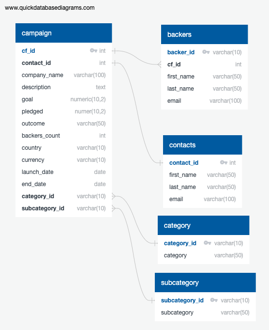

# Crowdfunding-ETL
## Description
This project extracts, transforms, and loads data to database on the backers of crowdfunding projects.

# Process
## Extract-Transform-Load
Source data is from [backer_info.csv](backer_info.csv). It was extracted and transformed in [Extract-Transform_final_code.ipynb](Extract-Transform_final_code.ipynb). The data was then prepared for loading as [backers.csv](backers.csv).

## ERD
A crowdfunding database already existed. The database schema was updated to the following to allow for the new *backers* tables.

The full database schema including design of the new *backers* table can be found in [crowdfunding_db_schema.sql](crowdfunding_db_schema.sql)

## SQL Analysis
Following loading the data into the crowdfunding_db, several queries were performed to extract informtion on contacts and backers. The analysis was performed as seen in [crowdfunding_SQL_Analysis.sql](crowdfunding_SQL_Analysis.sql). The analysis resulted in two exported tables: [email_contacts_remaining_goal_amount.csv](email_contacts_remaining_goal_amount.csv) and [email_backers_remaining_goal_amount.csv](email_backers_remaining_goal_amount.csv).